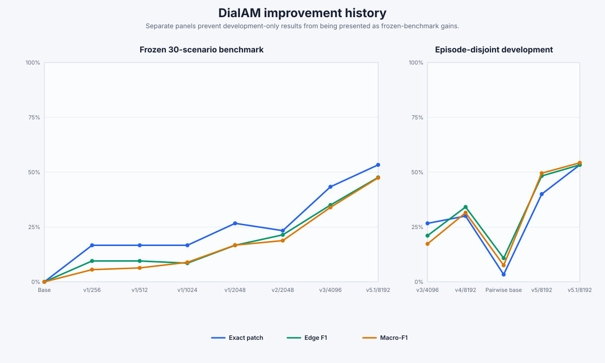

# DialAM experiment history

This ledger is generated from persisted aggregate reports. Development and frozen
results are deliberately separated; they are not interchangeable evaluation sets.



## Frozen 30-scenario benchmark

| Run | N | Exact patch | Edge F1 | Macro-F1 | False edges/update | NONE FP cases | Status |
|---|---:|---:|---:|---:|---:|---:|---|
| Base | — | 0.0% | 0.0% | 0.0% | 0.000 | — | baseline |
| v1/256 | 256 | 16.7% | 9.5% | 5.6% | 0.533 | 3 | v1 smoke |
| v1/512 | 512 | 16.7% | 9.5% | 6.3% | 0.533 | 3 | v1 curve |
| v1/1024 | 1024 | 16.7% | 8.5% | 8.9% | 0.700 | 3 | v1 curve |
| v1/2048 | 2048 | 26.7% | 16.7% | 16.7% | 0.667 | 2 | v1 curve |
| v2/2048 | 2048 | 23.3% | 21.4% | 18.8% | 0.867 | 5 | rejected: false edges worsened |
| v3/4096 | 4096 | 43.3% | 35.0% | 33.9% | 0.300 | 0 | previous selected model |
| v5.1/8192 | 8192 | 53.3% | 47.6% | 47.4% | 0.267 | 0 | PROMOTE_V5_1_AS_FINAL_DIRECTION |

## Episode-disjoint 30-scenario development set

| Run | N | Exact patch | Edge F1 | Macro-F1 | False edges/update | NONE FP cases | Status |
|---|---:|---:|---:|---:|---:|---:|---|
| v3/4096 | 4096 | 26.7% | 21.1% | 17.3% | 0.333 | 2 | development baseline |
| v4/8192 | 8192 | 30.0% | 34.1% | 31.5% | 0.333 | 4 | failed development NONE-calibration gate |
| Pairwise base | — | 3.3% | 10.8% | 7.5% | 4.467 | 6 | v5 formulation baseline |
| v5/8192 | 8192 | 40.0% | 48.3% | 49.5% | 0.667 | 6 | RETAIN_V3_V5_FAILED_DEVELOPMENT_GATE |
| v5.1/8192 | 8192 | 53.3% | 53.3% | 54.3% | 0.300 | 2 | PASS_RUN_REUSED_FROZEN_BENCHMARK |
| v6.1/12288 | 12288 | 33.3% | 40.0% | 39.7% | 0.667 | 5 | RETAIN_V5_1_V6_FAILED_DEVELOPMENT_GATE |
| v7.1/8192 | 8192 | 40.0% | 44.4% | 43.4% | 0.600 | 5 | RETAIN_V5_1_V7_FAILED_DEVELOPMENT_GATE |
| v7.2/8192 | 8192 | 53.3% | 52.2% | 50.7% | 0.333 | 2 | RETAIN_V5_1_V7_2_FAILED_DEVELOPMENT_GATE |

## Interpretation

- The frozen series records the real base-to-selected-model improvement.
- The development series records later formulation experiments without presenting them as frozen gains.
- Failed gates remain in the ledger because they establish what changed and why it was rejected.

Regenerate with:

```bash
.venv/bin/python scripts/build_dialam_experiment_history.py
```
