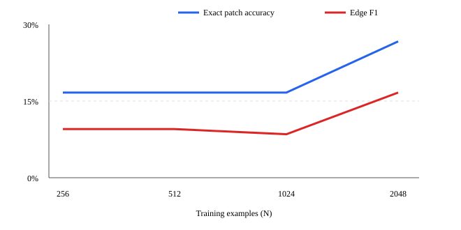

# DialAM v1 fixed data-efficiency curve

All four checkpoints use Qwen3-0.6B, the same frozen QLoRA configuration and seed, the same 30-scenario eval, and the same blinded judge rubric. Only the nested v1 training size changes.

| N | Exact patch | Edge F1 | Relation macro-F1 | False edges/update | False edges | FP SUPPORT / REPHRASE / ATTACK | NONE cases with FP | Judge robustness /4 |
|---:|---:|---:|---:|---:|---:|---:|---:|---:|
| 256 | 16.7% | 9.5% | 5.6% | 0.533 | 16 | 14 / 2 / 0 | 3/6 | 2.47 |
| 512 | 16.7% | 9.5% | 6.3% | 0.533 | 16 | 11 / 5 / 0 | 3/6 | 2.17 |
| 1024 | 16.7% | 8.5% | 8.9% | 0.700 | 21 | 9 / 5 / 7 | 3/6 | 1.87 |
| 2048 | 26.7% | 16.7% | 16.7% | 0.667 | 20 | 8 / 7 / 5 | 2/6 | 2.10 |

## Finding

n=2048 is the best v1 checkpoint on exact patch accuracy, edge F1, and relation macro-F1. It reaches 8/30 exact patches, but still emits 20 false edges (0.667/update). SUPPORT is the largest single false-positive class at every N: 14, 11, 9, then 8. On the six all-negative held-out scenarios, n=256/512/1024 make false predictions on 3/6 and n=2048 improves only to 2/6. The error therefore remains false-edge overprediction; scaling alone did not fix it. **No tested N reliably holds the behavior** under the frozen reliability bar.

The full aggregate metrics, frozen hashes, fixed config hash, checkpoint tree hashes, and private transcript/result hashes are in `reports/dialam_v1_efficiency_curve.json`. Text-bearing predictions, records, judge transcripts, QT30-derived training rows, and checkpoints remain local/ignored.



## Reproduce

```bash
.venv/bin/python scripts/build_dialam_training.py
for n in 256 512 1024 2048; do modal run scripts/modal_dialam_qlora.py --action train --size "$n" --dataset-version v1; done
for n in 256 512 1024 2048; do modal run scripts/modal_dialam_qlora.py --action evaluate --target tuned --size "$n" --dataset-version v1 --output-path "results/dialam_model_generation/n$n/predictions.jsonl"; done
for n in 256 512 1024 2048; do .venv/bin/python scripts/evaluate_dialam_model.py --predictions "results/dialam_model_generation/n$n/predictions.jsonl" --output-dir "results/dialam_model_eval/n$n" --approval APPROVE_DIALAM_MODEL_JUDGING; done
.venv/bin/python scripts/build_dialam_v1_curve_report.py
```
